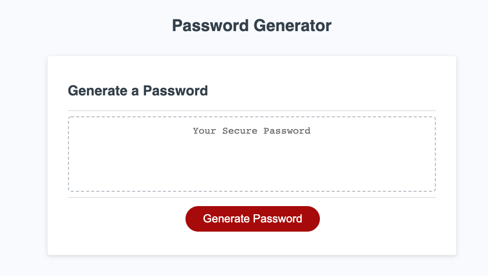
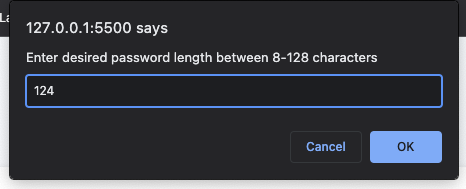
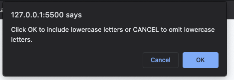
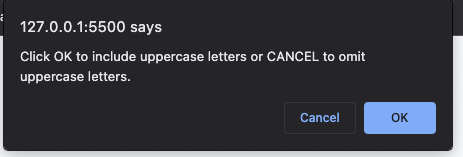
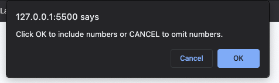
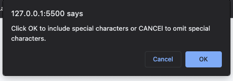
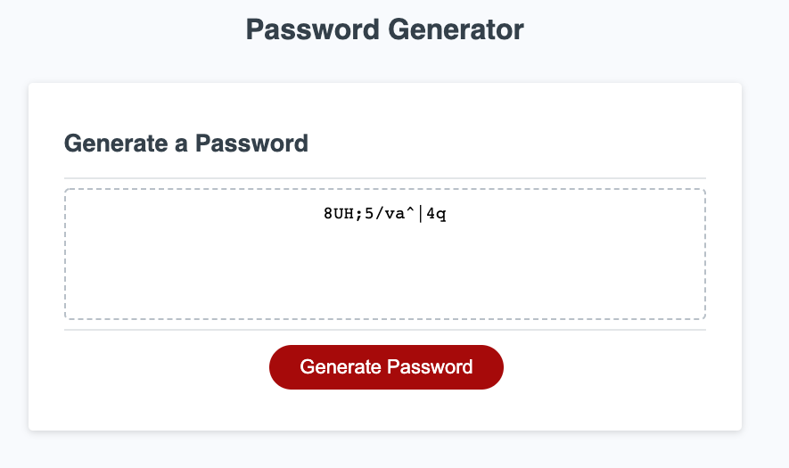

# 03-JavaScript Password Generator Challenge  
 "Generate-Thy-Password"

# Deployment
Live URL: https://nhastings1.github.io/Generate-Thy-Password/

# Goal

A employee with sensitive data needs a way to randomly generate a strong password that meets certain criteria to improve his overall security.

# Make it work

## Step 1
Deploy URL and click the button that says "Generate Password".

## Step 2
Enter password character length and hit "ok".

## Step 3
Generator will ask you to hit "ok" to add character type choices including lowercase, uppercase, numeric, and/or special characters. If you hit "cancel" it will omit the option.

## Step 4
Upon completing the prompts your randomly generated password will be written on the screen where it previously said "Your Secure Password".

# Recourses 
*Starter HTML & CSS code provided by KU-Edwards Bootcamp 